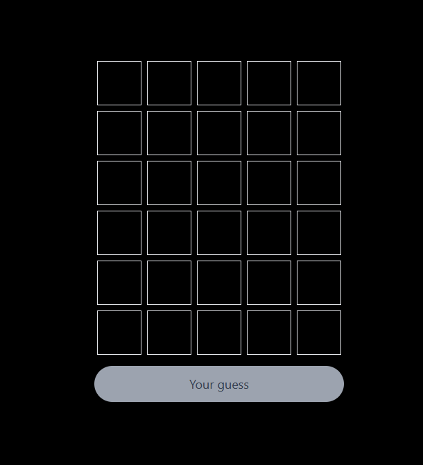
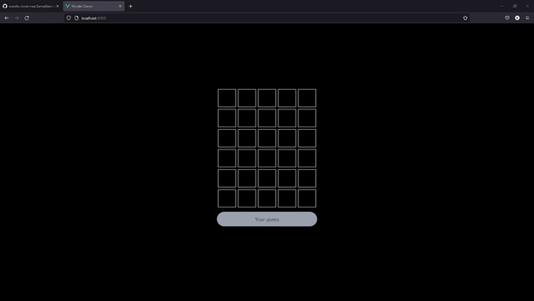

# Wordle clone on VueJS!

## 👀 Project Overview

- 😎 Another Wordle clone, the most cloned game of the moment!
- 👨‍💻 The main core of the game state and logic is in the store created by Vue Pinia 🍍. Check how it works [here](https://github.com/ribamarf01/wordle-clone-vue/blob/main/src/store/GameState.ts).
- 🔗 You can find this project live on: https://wordle-clone.ribamarf01.dev/.

## 🔥 Techs used

<div style="
    display: inline-block
">
    
    
    
    
    
</div>

## 🔧 Build Setup

```bash
# install dependencies
$ npm install

# serve with hot reload at localhost:3000
$ npm run dev

# build for production
$ npm run build

You can also use yarn!
```

## 📷 Project images





## 👽 External links

- 🔗 Original Wordle: https://www.nytimes.com/games/wordle/index.html
- 🔗 Here Lies Wordle: 2021–2027 (Full Answer List) (Sorry...): https://medium.com/@owenyin/here-lies-wordle-2021-2027-full-answer-list-52017ee99e86
